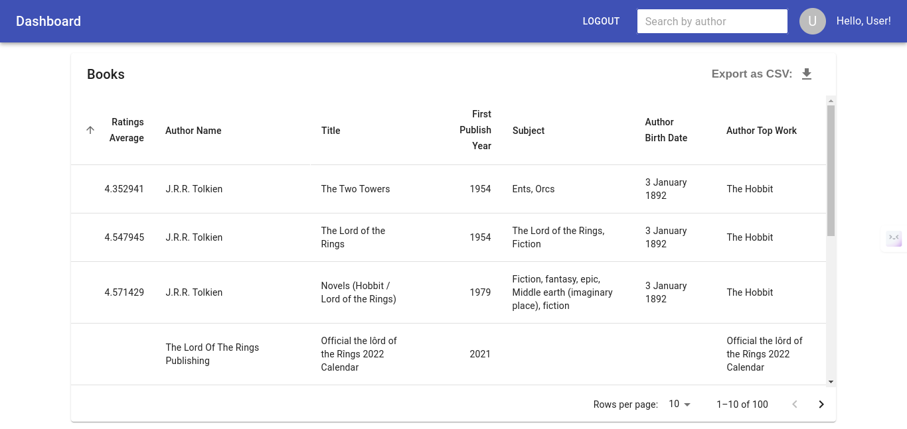
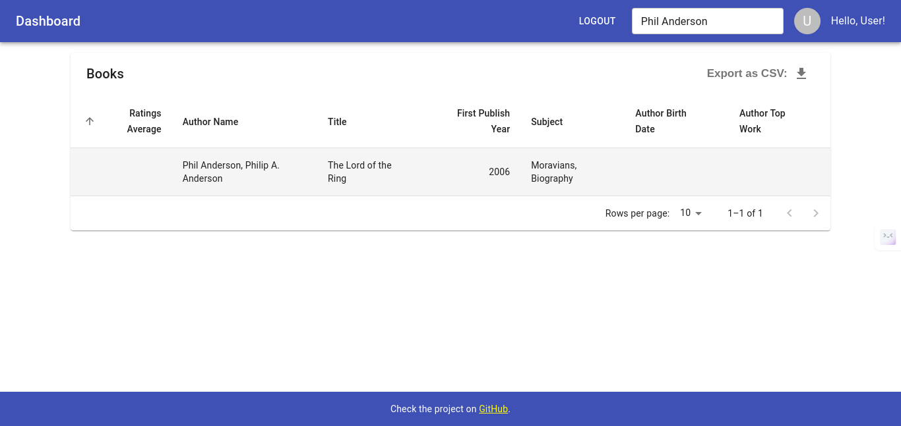
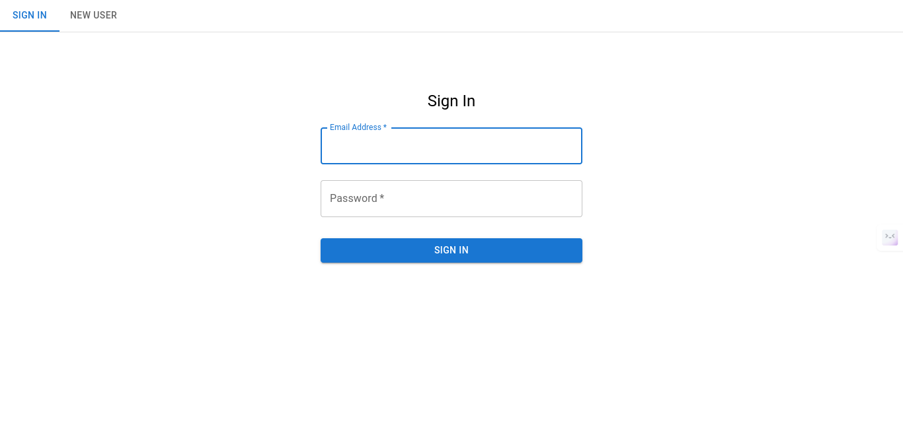

# Book Dashboard Application

## Table of Contents

- [Tech Stack](#tech-stack)
- [Features](#features)
- [Screenshots](#screenshots)
- [Installation](#installation)

## Tech Stack

- [React](https://reactjs.org/) - Frontend library for building user interfaces
- [Material-UI](https://mui.com/) - React UI framework
- [Firebase](https://firebase.google.com/) - Backend-as-a-Service (BaaS) platform

## Features

- **User Authentication:** Implement user authentication using Firebase Authentication to allow users to sign up and log in securely.
- **Searching:** Searching Books by their Author Name
- **Pagination:** Display a limited number of Book items per page and allow users to navigate through pages and change the number of items per page.
- **Sorting:** Allow users to sort the Book items by different attributes such as Title, Author, Subject and Year of Publication.
- **Loading State:** Display loading indicators or skeleton screens to indicate to users that data is being fetched or processed
- **Logout Functionality:** Implement a logout button to allow users to securely sign out of their accounts.

## Screenshots





## Usage

[Provide instructions on how to use or interact with the application]

## Installation

1. Clone the repository:

   ```bash
   git clone https://github.com/aviralsharma07/nua.git
   ```

2. Change into the project directory:
   ```bash
    cd nua
   ```
3. Install the dependencies:
   ```bash
    npm install
   ```
4. Start the development server:
   ```bash
    npm start
   ```
5. Open the application in your browser:
   ```bash
   http://localhost:3000
   ```
